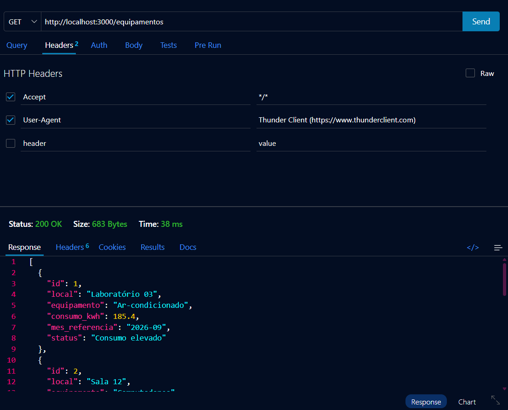
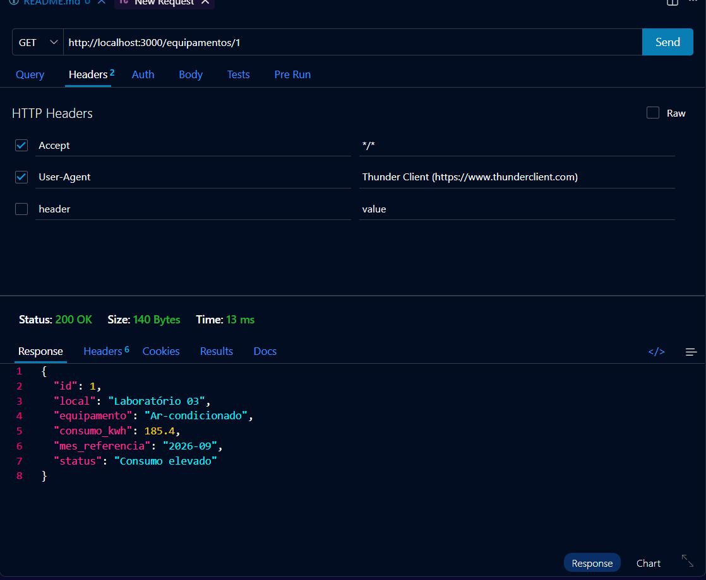
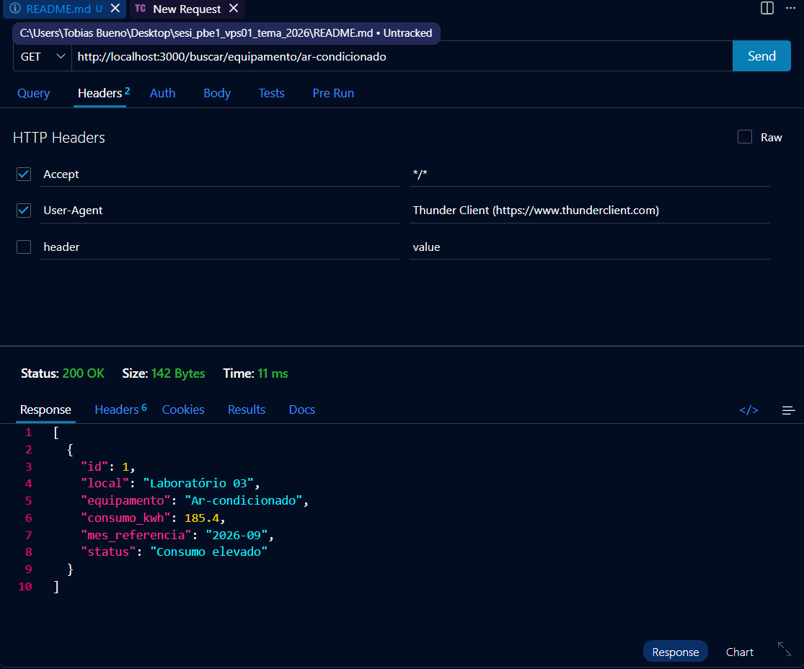
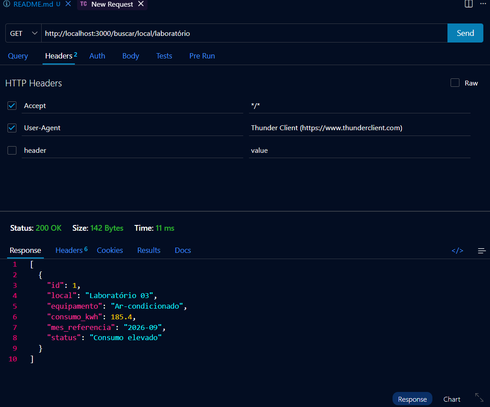
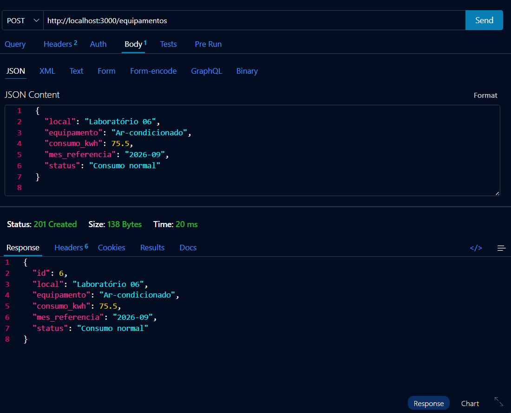
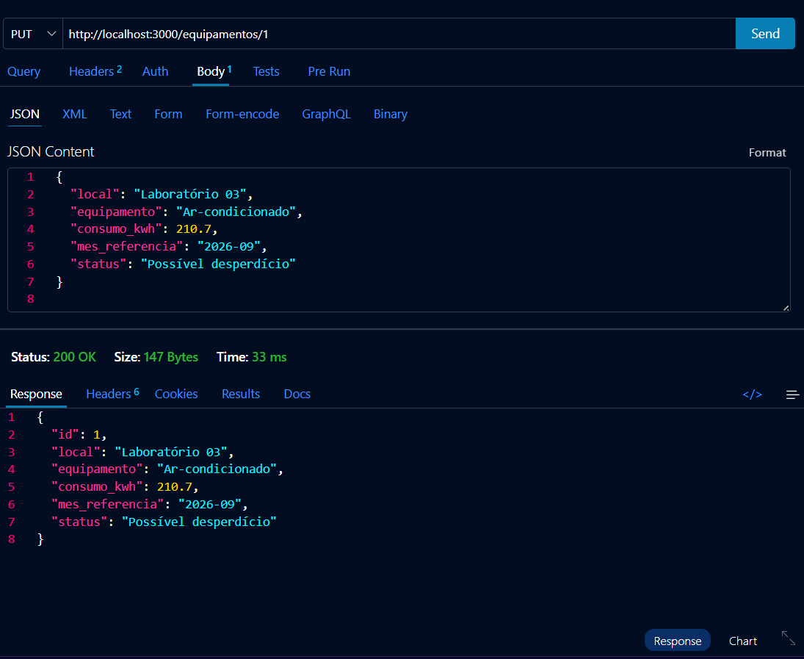
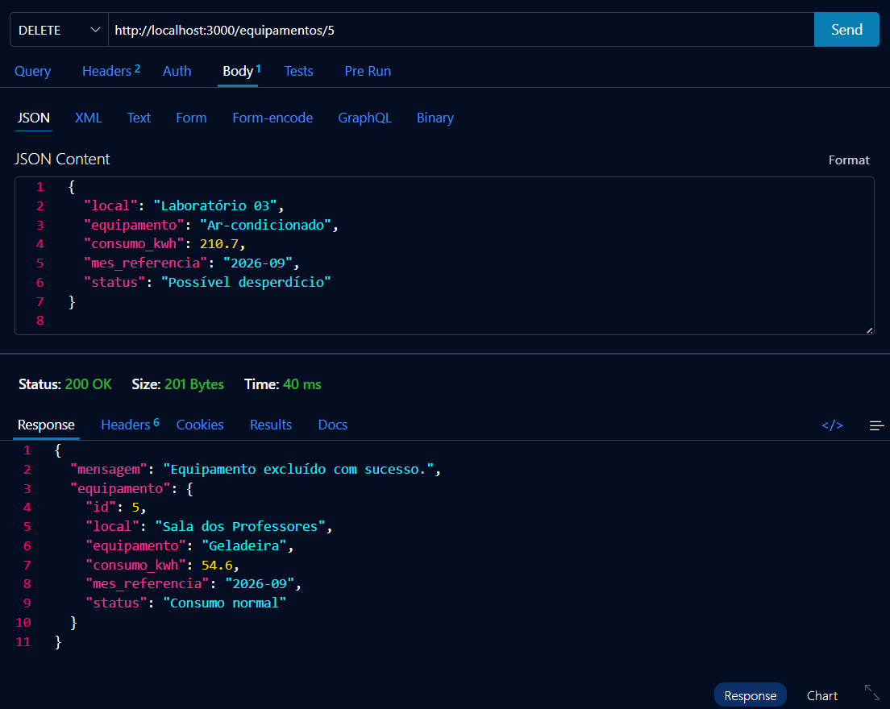

# ⚡ SESI - Sistema de Rastreamento de Consumo e Desperdício de Energia

## 📌 Sobre o Projeto

O **SESI (Sistema de Rastreamento de Consumo e Desperdício de Energia)** é uma API desenvolvida para monitorar e controlar o consumo de energia elétrica de equipamentos em diferentes ambientes.

O sistema permite cadastrar, consultar, atualizar, excluir e pesquisar equipamentos, facilitando a identificação de locais e equipamentos com consumo elevado de energia.

O objetivo é auxiliar no acompanhamento do consumo energético e contribuir para a redução do desperdício de energia.

---

## 🎯 Objetivos

- Monitorar o consumo de energia dos equipamentos.
- Identificar equipamentos com consumo elevado.
- Organizar os registros por local e mês de referência.
- Facilitar o gerenciamento dos dados de consumo.
- Contribuir para a conscientização sobre o desperdício de energia.

---

## 🛠️ Tecnologias Utilizadas

- Node.js
- Express
- JavaScript
- JSON
- Thunder Client
- Visual Studio Code

---

## 📂 Estrutura do Projeto

```text
SESI/
│
├── dados.json
├── package.json
├── server.js
├── README.md
│
└── prints/
    ├── 01_get_todos.png
    ├── 02_get_id.png
    ├── 03_busca_equipamento.png
    ├── 04_busca_local.png
    ├── 05_post_cadastro.png
    ├── 06_put_atualizacao.png
    └── 07_delete.png
```

---

### 📋 Descrição dos Campos

| Campo | Descrição |
|---|---|
| `id` | Identificador único do equipamento |
| `local` | Local onde o equipamento está instalado |
| `equipamento` | Nome do equipamento monitorado |
| `consumo_kwh` | Consumo de energia em kWh |
| `mes_referencia` | Mês utilizado como referência |
| `status` | Situação do consumo energético |

---

## 🔗 Rotas da API

A API disponibiliza rotas para consulta, pesquisa e gerenciamento dos equipamentos.

| Método | Rota | Descrição |
|---|---|---|
| GET | `/equipamentos` | Retorna todos os equipamentos |
| GET | `/equipamentos/:id` | Busca um equipamento pelo ID |
| GET | `/buscar/equipamento/:nome` | Busca pelo nome do equipamento |
| GET | `/buscar/local/:local` | Busca pelo local |
| POST | `/equipamentos` | Cadastra um novo equipamento |
| PUT | `/equipamentos/:id` | Atualiza um equipamento |
| DELETE | `/equipamentos/:id` | Exclui um equipamento |

---

## 🧪 Testes com Thunder Client

Os testes da API foram realizados utilizando a extensão Thunder Client, no Visual Studio Code.

### Teste 1 - GET Todos os Equipamentos

Retorna todos os equipamentos cadastrados.

**Requisição:**

```http
GET http://localhost:3000/equipamentos
```

**Print:**



---

### Teste 2 - GET por ID

Busca um equipamento específico pelo seu identificador.

**Print:**



---

### Teste 3 - Busca por Equipamento

Pesquisa os registros pelo nome do equipamento.

**Print:**



---

### Teste 4 - Busca por Local

Pesquisa os equipamentos cadastrados em determinado local.

**Print:**



---

### Teste 5 - POST Cadastro

Cadastra um novo equipamento no sistema.

**Print:**



---

### Teste 6 - PUT Atualização

Atualiza os dados de um equipamento existente.

**Print:**



---

### Teste 7 - DELETE Exclusão

Exclui um equipamento pelo seu identificador.

**Print:**



---

## ⚠️ Validações

O sistema verifica se todos os campos obrigatórios foram preenchidos durante o cadastro de um equipamento.

### Campos obrigatórios

- Local
- Equipamento
- Consumo em kWh
- Mês de referência
- Status

Caso algum campo obrigatório esteja vazio ou não seja informado, a API retorna uma mensagem de erro, impedindo o cadastro incompleto.
